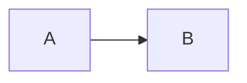

# Hugo Terminal + Tufte Theme

一个偏 **terminal** 气质并融合 **Tufte CSS** 排版思路的 Hugo 主题骨架，内置 **Catppuccin Latte/Mocha** 颜色主题切换。

## 已支持

- 数学公式（MathJax，支持 `$...$` 与 `$$...$$`）
- Mermaid 图表（代码块 ` ```mermaid ` 或 shortcode）
- Dark Mode（Catppuccin Latte ↔ Mocha，自动跟随系统 + 手动切换并持久化）
- Tufte 风格侧边注释 shortcode（`sidenote`）
- Vim 快捷键（`j/k` 小步滚动，`d/u` 半页，`gg/G` 到顶部/底部）

## 使用方式

```toml
# config.toml
theme = "hugo-tufte"

[params]
description = "A terminal-flavored Tufte blog"
footer = "© 2026"
```

内容示例：

```md
行内公式 $a^2+b^2=c^2$

$$
\sum_{n=1}^{\infty} \frac{1}{n^2} = \frac{\pi^2}{6}
$$


```

或者：

```md

flowchart LR
  Start --> End

```

侧边注释：

```md
正文里加一个注释这是一条 sidenote，可写 **Markdown**。继续正文。
```
