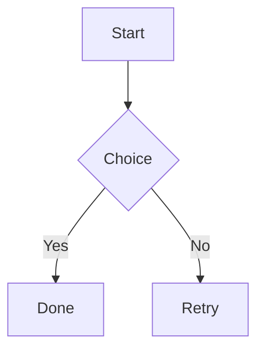

在这里写正文。

Tufte 侧注示例这是一条侧边注释，移动端可点击编号展开。。

行内公式：$e^{i\pi} + 1 = 0$。

块级公式：
$$
\int_0^1 x^2\,dx = \frac{1}{3}
$$

```mermaid
graph TD
  A[Start] --> B{Choice}
  B -->|Yes| C[Done]
  B -->|No| D[Retry]
```
